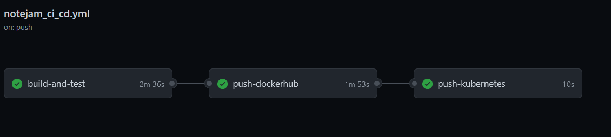

# Notejam
Azure Cloud implementation. Source app https://github.com/nordcloud/notejam

Framework selected: Django

URL: https://51.144.186.93/

### CI/CD Pipeline status:

[](https://github.com/arundil/notejam/actions/workflows/notejam_ci_cd.yml)

# Architecture
Originaly, Notejam was developed as a single monolitic solution (Web app + database).

Notejan web app has ben decoupled from the Database and put into a container.

To guarantee orchestrated into a aks service (Kubernetes).

In front of the load balancer access, an Nginx reverse proxy has been placed to protect any traffic overflow in the web app.

In this new architecture, the database has been decoupled and replaced with a Postgres SQL service. It is also firewaled against nginx public IP. 

For monitoring, I choose a solucion with grafana + influxDB all feeded with the info comming from nginx logs. Therefore many aspects of the network traffic can be analized. Nevertheless, metrics can be also taken from the application Insights. 


# Network sharping

Also, Nginx is configured with "ngx_http_limit_req_module" which reduces the number of requests for a single IP. More info  http://nginx.org/en/docs/http/ngx_http_limit_req_module.html

# Data preservation

Postgres SQL database has to be included in the Azure backup center to guarantee the preservation of data for at least 3 years. More info [here](https://docs.microsoft.com/en-us/azure/backup/backup-azure-database-postgresql#:~:text=Go%20to%20Backup%20Center%20%2D%3E%20Overview,to%20Backup%20vaults%20%2D%3E%20Backup).

# Service Availability 

AKS service will keep up the containers running with high availability. This Service can be deployed with highly available multi-region in case of emergency. This setting applies to the VM pool set. More info [here](https://docs.microsoft.com/en-us/azure/aks/availability-zones)

# Continuous integration

Continuous integration has been set up using GitHub action.  The workflow is the following:



**1) Build and test:**

It will build nginx & notejam with docker-compose.
Nojejam will be connected with the remote database using (hidden) environment variables.
Finally to test everything I wait 30 secs waiting till docker-compose is up and I launched a curl command to https://localhost verifying afterward if I received "HTTP 200" as a return code.

**2) Dockerize & pull to DockerHub:**

Once the test is done, I build again the dockers and push them to the docker hub.

**3) Deploy to Kubernetes:**

Finally, I log into azure with a Service Principal to get the cluster credentials, and I apply my Kubernetes YAML file with kubectl to pull the changes.


To fulfill the continuous integration within developer teams, at least these three branches have to be created in the future:

1) Dev --> Development
2) QA --> For Quality assurance
3) Prod --> The one deployed in customer subscription aks service.

Ci/CD pipelines can be activated/deactivated per branch in order to preserve the continuous integration for all the developers. In this example, I only implemented the one for the main branch to simplify the whole deployment.


# Logs and monitoring

A solution with Grafana+InfluxDB could be implemented taking as feed data Nginx logs. That will allow seeing all the incoming traffic. Other solutions could be Elastic Search + Kibana. Also Azure provides Insights where a lot of info from each container can be obtained.  


# Try it out!
To deploy the infrastructure, you can do it via ansible. To install ansible you can follow this link: https://docs.ansible.com/ansible/latest/installation_guide/index.html . After that follow these steps:

1) Create a service principal in your Azure Active Directory and give it permissions to your subscription. More info [here](https://docs.microsoft.com/en-us/azure/active-directory/develop/howto-create-service-principal-portal).

2) Modify the config_file.yml with your service principal data and your cluster nodes.

3) Create a secret.yml file with the following data:

```yaml
secret: your_service_principal_secret
dbsecret: your_db_secret
```


3) Then, execute it with this line (you will need to create a secret file or decrypt it asking me the password):

```bash
ansible-playbook -i hosts deployment.yaml --ask-become-pass --ask-vault-pass
```

